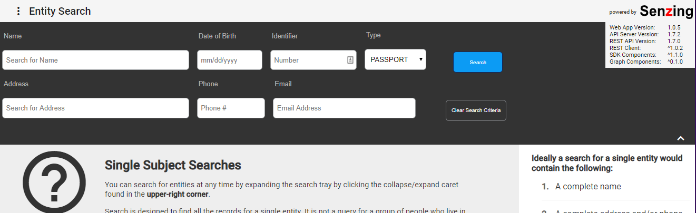
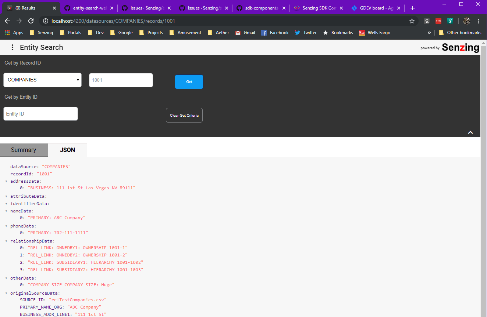
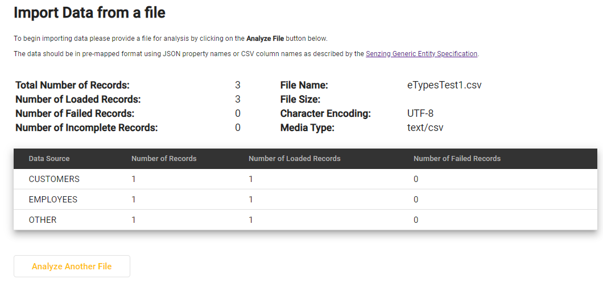
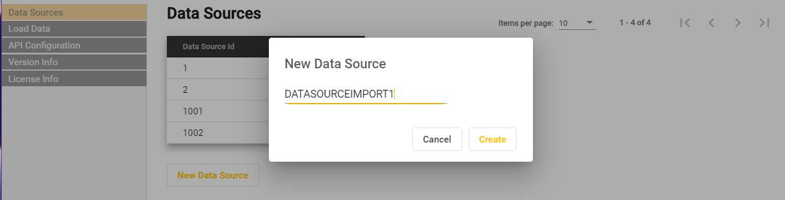
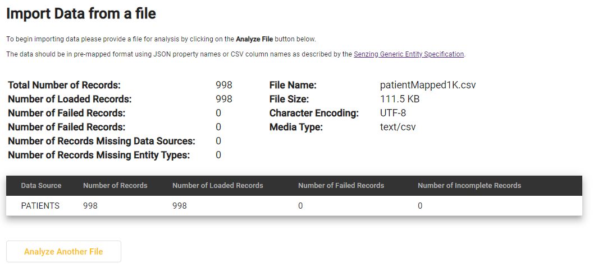
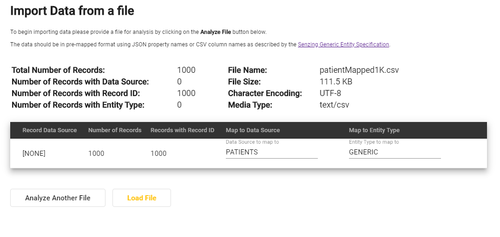
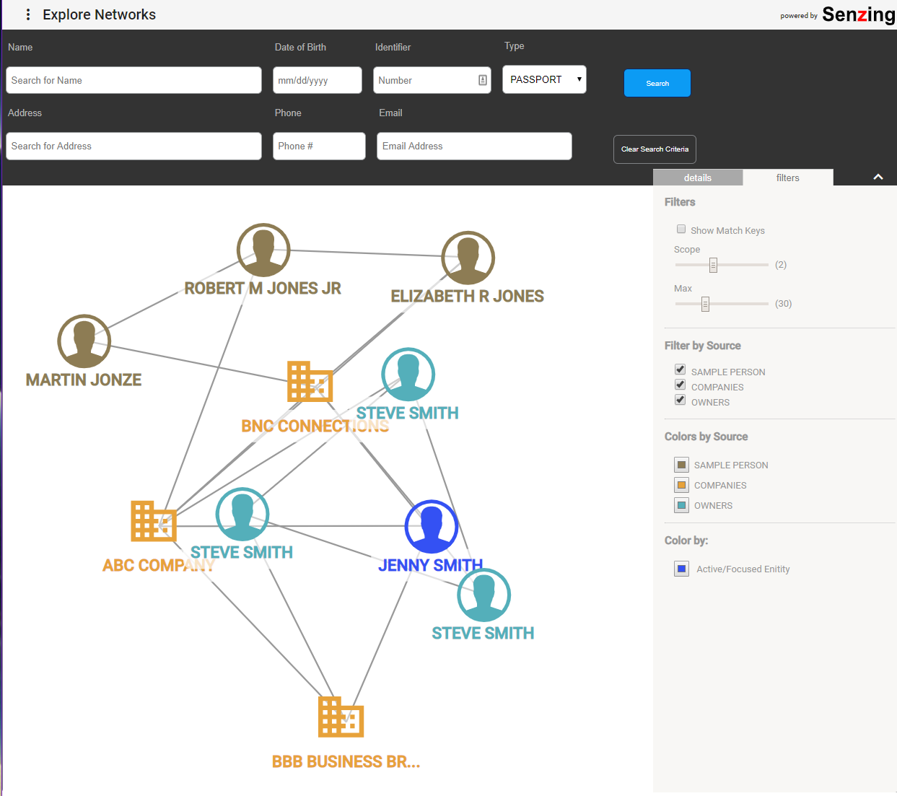
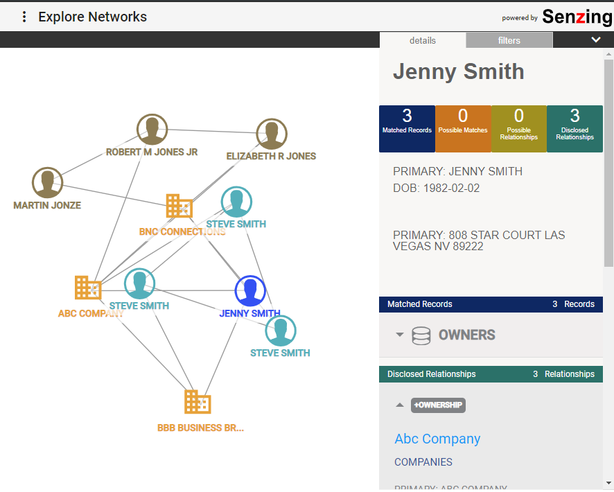
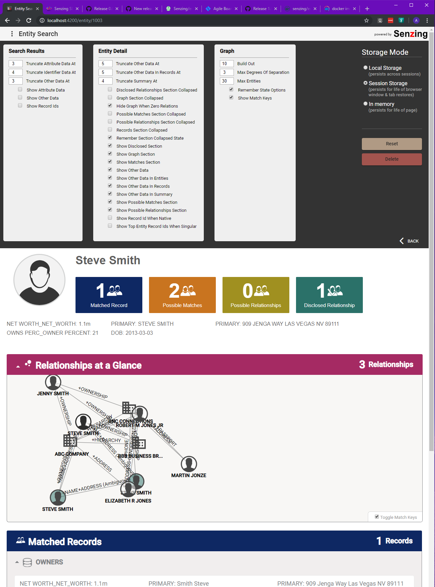

# Changelog

All notable changes to this project will be documented in this file.

The format is based on [Keep a Changelog](https://keepachangelog.com/en/1.0.0/),
[markdownlint](https://dlaa.me/markdownlint/),
and this project adheres to [Semantic Versioning](https://semver.org/spec/v2.0.0.html).

## [2.2.1] - 2021-02-01
- updated @senzing/sdk-graph-components to 2.1.3
- updated @senzing/sdk-components-ng to 2.2.1
- fixed bug where entity detail would not render when entity had 0 relationships.

## [2.2.0] - 2021-01-20
- updated senzing libs to 2.2.0
- bug in route resolver to only accept numbers for record paths fixed
- Select Identifiers in Search Form feature added.

## [2.1.2] - 2020-12-20
- updated senzing libs to 2.2.0
- bug in route resolver to only accept numbers for record paths fixed

## [2.1.1] - 2020-10-02

Bugfixes for:
- [Large graph filtering](https://github.com/Senzing/sdk-graph-components/issues/27)
- [Large graph color highlights by datasource](https://github.com/Senzing/sdk-components-ng/issues/162)
- [Detail Graph lifecycle issue on in-component navigation](https://github.com/Senzing/sdk-components-ng/issues/156)
- [Graph tooltips showing null for address and phone numbers](https://github.com/Senzing/sdk-graph-components/issues/42)
- [Enitity Id added to detail report](https://github.com/Senzing/sdk-components-ng/issues/159)
- [Search by Attribute option pinned to menu options](https://github.com/Senzing/entity-search-web-app/issues/131)
- [Best name logic fix](https://github.com/Senzing/sdk-components-ng/issues/156)

## [2.1.0] - 2020-09-23

Compatibility release for framework upgrade to Angular 10: see [https://blog.angular.io/version-10-of-angular-now-available-78960babd41](https://blog.angular.io/version-10-of-angular-now-available-78960babd41)

Major updates to most dependency versions have also been made which should improve file sizes, security, and stability.

The following Senzing sponsored projects have also been updated to operate on Angular 10,
see the following links for associated tickets:
- [sdk-components-ng/issues/143](https://github.com/Senzing/sdk-components-ng/issues/143)
- [rest-api-client-ng/issues/39](https://github.com/Senzing/rest-api-client-ng/issues/39)
- [sdk-graph-components/issues/37](https://github.com/Senzing/sdk-graph-components/issues/37)

## [2.0.1] - 2020-09-TBD

The scripts no longer write any configuration or runtime configuration information to the filesystem. Instead, the options are read from either ENV vars or Command Line arguements in to a data store class, which is then accessed by scripts and endpoints that need access to these arguements. This was done to support immutable containers(see https://cloud.google.com/solutions/best-practices-for-operating-containers#ensure_that_your_containers_are_stateless_and_immutable)

Added:

- run/runtime.datastore.js
- run/runtime.datastore.config.js
- src/app/services/config.service.ts
- Interactive TTY "type any key to quit" web server prompt

Removed:

- proxy.conf.tmpl.json
- auth/auth.conf.json
- auth/auth.conf.tmpl.admin.json
- auth/auth.conf.tmpl.full.json
- auth/auth.conf.tmpl.json
- auth/cors.conf.tmpl.json
- any direct references to static files ie: /auth/auth.conf.json in ts files

Moved:

- auth-server.js → run/authserver/index.js 
- auth/auth.js → run/authserver/auth.js
- webserver.js → run/webserver/index.js

### Updated ENV Vars REQUIRED

There are several NEW env vars/command args that now are required for full operation, your docker formations or scripts should be updated.

## [2.0.0] - 2020-07-16

Compatibility release for interacting with the 2.0.0 [senzing-rest-api-spec](https://github.com/Senzing/senzing-rest-api-specification) and [senzing-api-server](https://github.com/Senzing/senzing-api-server). For information on specifics of endpoint changes see below:

- [@senzing/rest-api-client-ng@2.0.0](https://github.com/Senzing/rest-api-client-ng/releases/tag/2.0.0)
- [senzing-rest-api-specification PR #44](https://github.com/Senzing/senzing-rest-api-specification/pull/44)
- [senzing-api-server PR #172](https://github.com/Senzing/senzing-api-server/pull/172)

## [1.2.1] - 2020-04-24

### Added to 1.2.1

- Show version information (for diagnostics)
- Open search results directly in Graph view
- Allow the user to collapse/expand the filters/detail drawer in the Graph view.
- Added MSSQL support
- Added Search by *record Id* or *entity Id* form interfaces
- Added Record JSON viewer
- Added Admin functionality. (see [Readme](https://github.com/Senzing/entity-search-web-app#admin-area) for more details)
  - added ability to view datasources available to an instance
  - added ability to do bulk import or csv or json files in to a datasource
  - added randomly generated JWT token to `/admin` routes by default. other authentication options include external SSO relay and NONE.
- Implemented CORS support for allowing the container to tell the client to directly request api resources. Default is disabled.
- Implemented CSP (Content Security Policy) - enabled by default. see #96 for more details.
- relevant tickets:
  [#66](https://github.com/Senzing/entity-search-web-app/pull/66),
  [#67](https://github.com/Senzing/entity-search-web-app/pull/67),
  [#68](https://github.com/Senzing/entity-search-web-app/pull/68),
  [#73](https://github.com/Senzing/entity-search-web-app/pull/73),
  [#74](https://github.com/Senzing/entity-search-web-app/pull/74),
  [#76](https://github.com/Senzing/entity-search-web-app/pull/76),
  [#83](https://github.com/Senzing/entity-search-web-app/pull/83),
  [#84](https://github.com/Senzing/entity-search-web-app/pull/84),
  [#89](https://github.com/Senzing/entity-search-web-app/pull/89),
  [#96](https://github.com/Senzing/entity-search-web-app/pull/96)

### Admin Functionality

## [1.0.4] - 2019-11-19

### Added to 1.0.4

- Standalone graph.
- graph filtering.
- embedded rail-format entity detail viewer (for graph)
- search result(s) directly displayed in standalone graph.
- graph color(s) by datasource membership.
- SSL support for docker image.
- basic auth support (alpha) for docker image.
- premature loading indicator disapearing fix.
- relevant tickets:
  [#34](https://github.com/Senzing/entity-search-web-app/pull/34),
  [#67](https://github.com/Senzing/entity-search-web-app/pull/67),
  [#69](https://github.com/Senzing/entity-search-web-app/pull/69),
  [#71](https://github.com/Senzing/entity-search-web-app/pull/71)

## [1.0.3] - 2019-09-30

### Added to 1.0.3

- [sdk-components-ng](https://github.com/Senzing/sdk-components-ng) updated to [1.0.9](https://github.com/Senzing/sdk-components-ng/releases/tag/1.0.9) and [sdk-graph-components](https://github.com/Senzing/sdk-graph-components) updated to [0.0.6](https://github.com/Senzing/sdk-graph-components/releases/tag/0.0.6)

- Preferences UI interface added to top ribbon
- Added [SzPrefsService](https://senzing.github.io/sdk-components-ng/injectables/SzPrefsService.html)
- Added [SzPreferencesComponent](https://senzing.github.io/sdk-components-ng/components/SzPreferencesComponent.html)
- CSS for responsive breakpoint(s) and/or reflow on narrow width
- Various UI/UX layout bugfixes
- Graph should reload on entityIdChange
- Graph should collapse on *0* results
- Include "other data" in records area.
- Text highlighting no longer triggers click-thru
- Search identifiers drop-down should auto-update on api config change

## [1.0.2] - 2019-08-03

### Added to 1.0.2

- SDK components updated to [1.0.8](https://github.com/senzingiris/sdk-components-ng/releases/tag/1.0.8)
- Graph components updated to [0.0.4](https://github.com/Senzing/sdk-graph-components/releases)
- PDF downloads
- minor UI/UX changes

### Fixed in 1.0.2

- identifier dropdown issue
- proxy.conf perm issue
- entity icon fixes
- graph overflow issue
- relevant tickets:
  [#32](https://github.com/Senzing/entity-search-web-app/pull/32),
  [#36](https://github.com/Senzing/entity-search-web-app/pull/36),
  [#47](https://github.com/Senzing/entity-search-web-app/pull/47),
  [#51](https://github.com/Senzing/entity-search-web-app/pull/51),
  [#53](https://github.com/Senzing/entity-search-web-app/pull/53)

## [1.0.1] - 2019-06-26

### Added to 1.0.1

- e2e tooling
- wonky graph styling issue
- basic unit tests fixes
- sdk-components-ng version bump. 1.0.4 -> **1.0.5**
- adds licence badge to readme. 
- adds `npm run e2e`, `npm run e2e:headless`, `npm run test`, and `npm run test:headless` scripts
- added .travis.yml for CI build/test integration
- angular.json configuration changes to support path refactoring

## [1.0.0] - 2019-06-20

### Added to 1.0.0

- Initial release of the entity search web app.
