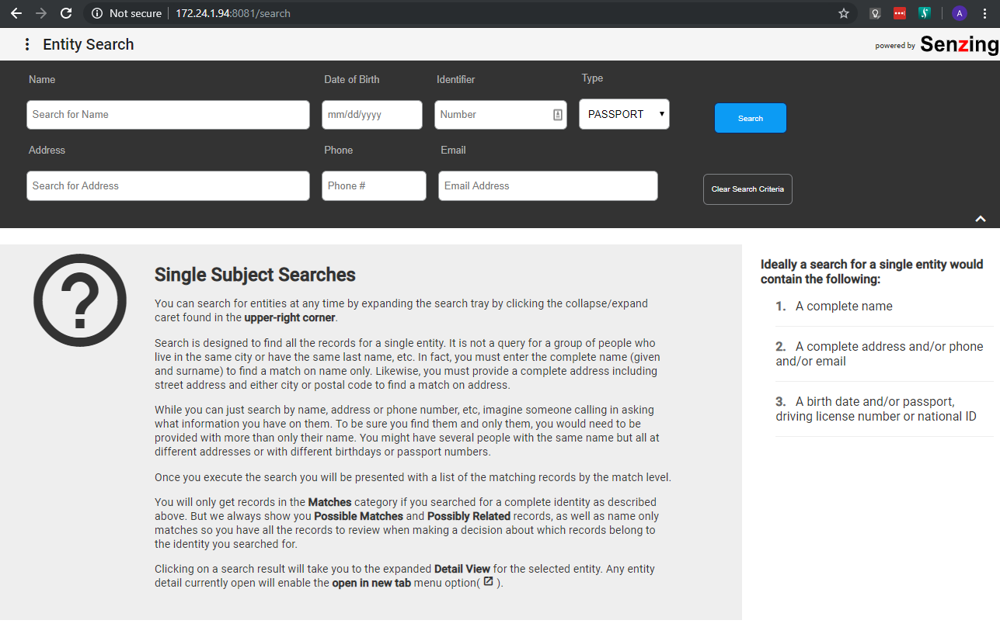

# Entity Search Web App

[](https://travis-ci.com/Senzing/entity-search-web-app)
[](https://github.com/Senzing/entity-search-web-app/blob/master/LICENSE)



## Overview

This is an implementation of an entity search app which uses the senzing rest api server microservice to access functions of the Senzing API through a web interface.

### Related artifacts

1. [DockerHub](https://hub.docker.com/r/senzing/entity-search-web-app)
1. [Helm Chart](https://github.com/Senzing/charts/tree/master/charts/senzing-entity-search-web-app)

### Contents

1. [Entity Search Web App](#entity-search-web-app)
   1. [Overview](#overview)
      1. [Related artifacts](#related-artifacts)
      1. [Contents](#contents)
      1. [Legend](#legend)
   1. [Preparation](#preparation)
      1. [Prerequisite software](#prerequisite-software)
      1. [Pull latest docker images](#pull-latest-docker-images)
      1. [Clone repository](#clone-repository)
      1. [Initialize Senzing](#initialize-senzing)
      1. [Configuration](#configuration)
      1. [Volumes](#volumes)
   1. [Using docker-compose](#using-docker-compose)
   1. [Using docker](#using-docker)
      1. [Docker network](#docker-network)
      1. [Run](#run)
      1. [Using SSL](#using-ssl)
         1. [Prerequisites](#prerequisites)
         1. [Self-Signed Certificates](#self-signed-certificates)
         1. [Setting up SSL using Docker Stack](#setting-up-ssl-using-docker-stack)
      1. [Admin Area](#admin-area)
         1. [Admin Area Configuration](#admin-area-configuration)
      1. [Security Safeguards](#security-safeguards)
         1. [CORS (Cross Origin Request)](#cors-cross-origin-request)
         1. [CSP (Content Security Policy)](#csp-content-security-policy)
      1. [Air Gapped Environments](#air-gapped-environments)
      1. [Building from Source](#building-from-source)
   1. [Development](#development)
      1. [Development server](#development-server)
      1. [Production Server](#production-server)
      1. [Code scaffolding](#code-scaffolding)
   1. [Testing](#testing)
      1. [Running unit tests](#running-unit-tests)
      1. [Running end-to-end tests](#running-end-to-end-tests)
   1. [Further help](#further-help)

### Legend

1. :thinking: - A "thinker" icon means that a little extra thinking may be required.
   Perhaps you'll need to make some choices.
   Perhaps it's an optional step.
1. :pencil2: - A "pencil" icon means that the instructions may need modification before performing.
1. :warning: - A "warning" icon means that something tricky is happening, so pay attention.

## Preparation

### Prerequisite software

The following software programs need to be installed:

1. [docker](https://github.com/Senzing/knowledge-base/blob/master/HOWTO/install-docker.md)
2. [docker-compose](https://github.com/Senzing/knowledge-base/blob/master/HOWTO/install-docker-compose.md)

### Pull latest docker images

1. Pull the latest release of this app from [Docker Hub](https://hub.docker.com/r/senzing/entity-search-web-app).
   Example:

    ```console
    sudo docker pull senzing/entity-search-web-app
    ```

1. Pull the latest of the api server from [DockerHub](https://hub.docker.com/r/senzing/senzing-api-server).
   Example:

    ```console
    sudo docker pull senzing/senzing-api-server
    ```

### Clone repository

1. Set these environment variable values:

    ```console
    export GIT_ACCOUNT=senzing
    export GIT_REPOSITORY=entity-search-web-app
    export GIT_ACCOUNT_DIR=~/${GIT_ACCOUNT}.git
    export GIT_REPOSITORY_DIR="${GIT_ACCOUNT_DIR}/${GIT_REPOSITORY}"
    ```

1. Follow steps in [clone-repository](https://github.com/Senzing/knowledge-base/blob/master/HOWTO/clone-repository.md) to install the Git repository.

### Initialize Senzing

1. If Senzing has not been initialized, visit
   "[How to initialize Senzing with Docker](https://github.com/Senzing/knowledge-base/blob/master/HOWTO/initialize-senzing-with-docker.md)".

### Configuration

Configuration values specified by environment variable or command line parameter.

- **[SENZING_DATA_VERSION_DIR](https://github.com/Senzing/knowledge-base/blob/master/lists/environment-variables.md#senzing_data_version_dir)**
- **[SENZING_ETC_DIR](https://github.com/Senzing/knowledge-base/blob/master/lists/environment-variables.md#senzing_etc_dir)**
- **[SENZING_G2_DIR](https://github.com/Senzing/knowledge-base/blob/master/lists/environment-variables.md#senzing_g2_dir)**
- **[SENZING_NETWORK](https://github.com/Senzing/knowledge-base/blob/master/lists/environment-variables.md#senzing_network)**
- **[SENZING_RUNAS_USER](https://github.com/Senzing/knowledge-base/blob/master/lists/environment-variables.md#senzing_runas_user)**
- **[SENZING_VAR_DIR](https://github.com/Senzing/knowledge-base/blob/master/lists/environment-variables.md#senzing_var_dir)**

### Volumes

1. :pencil2: Specify the directory containing the Senzing installation.
   Use the same `SENZING_VOLUME` value used when performing
   "[How to initialize Senzing with Docker](https://github.com/Senzing/knowledge-base/blob/master/HOWTO/initialize-senzing-with-docker.md)".
   Example:

    ```console
    export SENZING_VOLUME=/opt/my-senzing
    ```

    1. Here's a simple test to see if `SENZING_VOLUME` is correct.
       The following commands should return file contents.
       Example:

        ```console
        cat ${SENZING_VOLUME}/g2/g2BuildVersion.json
        cat ${SENZING_VOLUME}/data/1.0.0/libpostal/data_version
        ```

    1. :warning:
       **macOS** - [File sharing](https://github.com/Senzing/knowledge-base/blob/master/HOWTO/share-directories-with-docker.md#macos)
       must be enabled for `SENZING_VOLUME`.
    1. :warning:
       **Windows** - [File sharing](https://github.com/Senzing/knowledge-base/blob/master/HOWTO/share-directories-with-docker.md#windows)
       must be enabled for `SENZING_VOLUME`.

1. Identify the `data_version`, `etc`, `g2`, and `var` directories.
   Example:

    ```console
    export SENZING_DATA_VERSION_DIR=${SENZING_VOLUME}/data/1.0.0
    export SENZING_ETC_DIR=${SENZING_VOLUME}/etc
    export SENZING_G2_DIR=${SENZING_VOLUME}/g2
    export SENZING_VAR_DIR=${SENZING_VOLUME}/var
    ```

## Using docker-compose

1. Run in a docker-compose formation.
   Example:

    ```console
    cd ${GIT_REPOSITORY_DIR}
    sudo \
      SENZING_DATA_VERSION_DIR=${SENZING_DATA_VERSION_DIR} \
      SENZING_ETC_DIR=${SENZING_ETC_DIR} \
      SENZING_G2_DIR=${SENZING_G2_DIR} \
      SENZING_VAR_DIR=${SENZING_VAR_DIR} \
      docker-compose up senzing-webapp
    ```

1. Verify that containers are running and accessible:
    1. Open a web browser on [http://localhost:8081](http://localhost:8081) (or substitute hostname or IP for `localhost`).
    1. Alternatively, `curl` can be used.
       Example:

       ```console
       curl http://machine-host-name:8081
       ```

## Using docker

### Docker network

The following docker containers communicate over a docker network.

1. :thinking: Find or create a docker network.
   Perform one of the following procedures.

    1. Find a docker network.
        1. List docker networks.
           Example:

            ```console
            sudo docker network ls
            ```

        1. :pencil2: Specify docker network.
           Choose value from NAME column of `docker network ls`.
           Example:

            ```console
            export SENZING_NETWORK=*nameofthe_network*
            ```

    1. Create docker network.
        1. :pencil2: Specify network name.
           Example:

            ```console
            export SENZING_NETWORK=sz-api-network
            ```

        1. Create docker network.
           Example:

            ```console
            sudo docker network create -d bridge ${SENZING_NETWORK}
            ```

1. Construct parameter for `docker run`.
   Example:

    ```console
    export SENZING_NETWORK_PARAMETER="--net ${SENZING_NETWORK}"
    ```

### Run

1. Attach senzing-api-server.
   Example:

    ```console
    sudo docker run \
      --interactive \
      --name=senzing-api-server \
      --publish 8080:8080 \
      --rm \
      --tty \
      --volume ${SENZING_DATA_VERSION_DIR}:/opt/senzing/data \
      --volume ${SENZING_ETC_DIR}:/etc/opt/senzing \
      --volume ${SENZING_G2_DIR}:/opt/senzing/g2 \
      --volume ${SENZING_VAR_DIR}:/var/opt/senzing \
      ${SENZING_NETWORK_PARAMETER} \
      senzing/senzing-api-server \
        -concurrency 10 \
        -httpPort 8080 \
        -bindAddr all \
        -iniFile /etc/opt/senzing/G2Module.ini
    ```

1. Run entity search web app.
   Example:

    ```console
    sudo docker run \
      --env SENZING_API_SERVER_URL=http://senzing-api-server:8080 \
      --env SENZING_WEB_SERVER_PORT=8081 \
      --interactive \
      --name=senzing-webapp \
      --publish 8081:8081 \
      --rm \
      --tty \
      ${SENZING_NETWORK_PARAMETER} \
      senzing/entity-search-web-app
    ```

1. To verify that containers are running and accessible:

    1. Open a web browser on [http://localhost:8081](http://localhost:8081) (or substitute hostname or IP for `localhost`).

    1. Alternatively, `curl` can be used.
       Example:

       ```console
       curl http://machine-host-name:8081
       ```

### Using SSL

The main docker image for the senzing webapp supports running it's webserver over HTTPS. In order to deploy the webapp in a secure way, you must be using the image in a swarm configuration, rather than a standalone service. For more information on swarms and why this is a requirement see [Docker Swarm Secrets](https://docs.docker.com/engine/swarm/secrets/)

#### Prerequisites

1. docker client and daemon with *API version* > 1.25
you can check what api version your docker client is running by typing `docker version`
2. Valid SSL certificates(server.key and server.cert) for the webserver. (if you don't have them, you can use a [self-signed certificate](#self-signed-certificates) in the interim)

#### Self-Signed Certificates

A self-signed certificate is sufficent to establish a secure, HTTPS connection for development purposes. It should not be used in a production environment, but if you're just trying to test out encryption to see how it works it's a viable short-term solution. You will need *OpenSSL* installed on your system to generate these. Just do a [google search](https://www.google.com/search?q=using+self+signed+SSL+certificate) or check out [this article](https://flaviocopes.com/express-https-self-signed-certificate/) or [this one](https://flaviocopes.com/express-https-self-signed-certificate/) and come back to this section once you have the server.cert and server.key files

#### Setting up SSL using Docker Stack

For convenience we have included a docker compose [file](./docker-stack.yml) specifically for running in SSL configuration. We suggest starting with this example if you're not familiar how stacks work(you will want a different yml file for stack deployment for a number of reasons).
If you open that example up you will see two lines at the bottom of the file:

```yaml
  SZ_WEBAPP_SSL_CERT:
    file: '../CERTS/server.cert'
  SZ_WEBAPP_SSL_KEY:
    file: '../CERTS/server.key'
```

Those lines tell docker to pass two secrets to the services defined in the docker compose file. These two lines should point to the location of the *server.key* and *server.cert* file you wish to use. The configuration of the *senzing-api-server* service may differ from how you have set up your configuration to run. You should copy over the configuration options defined in your _already working_ docker-compose.yml file to the docker-stack.yml file.
The other important lines(under the *senzing-webapp* service definition) are:

```yaml
secrets:
      - source: SZ_WEBAPP_SSL_CERT
        target: server.cert
        uid: '1001'
        gid: '1001'
      - source: SZ_WEBAPP_SSL_KEY
        target: server.key
        uid: '1001'
        gid: '1001'
```

They tell the webapp service to use the content of the secrets defined at the bottom of the file. It's like passing the files in.. but also not. docker secrets are weird.

Next you will deploy the services defined in the yml file to your swarm manager by typing `sudo SENZING_DATA_VERSION_DIR=${SENZING_DATA_VERSION_DIR} SENZING_ETC_DIR=${SENZING_ETC_DIR} SENZING_G2_DIR=${SENZING_G2_DIR} SENZING_VAR_DIR=${SENZING_VAR_DIR} docker stack deploy -c docker-stack.yml senzing-webapp`
check that the services started up successfully by typing `docker stack ps senzing-webapp`. the result should look like the following

```bash
ID                  NAME                                  IMAGE                               NODE                DESIRED STATE       CURRENT STATE               ERROR               PORTS
7mxc4jru51pl        senzing-webapp_senzing-api-server.1   senzing/senzing-api-server:latest   americium           Running             Running about an hour ago
rnguy9d2incb        senzing-webapp_senzing-webapp.1       senzing/entity-search-web-app:ssl   americium           Running             Running about an hour ago
```

next you can initiate a curl request to your webserver with `curl -kvv https://localhost:8081`. The output should looks something like the following:

```bash
* Rebuilt URL to: https://localhost:8081/
*   Trying 127.0.0.1...
* TCP_NODELAY set
* Connected to localhost (127.0.0.1) port 8081 (#0)
* ALPN, offering h2
* ALPN, offering http/1.1
* successfully set certificate verify locations:
*   CAfile: /etc/ssl/certs/ca-certificates.crt
  CApath: /etc/ssl/certs
* TLSv1.3 (OUT), TLS handshake, Client hello (1):
* TLSv1.3 (IN), TLS handshake, Server hello (2):
* TLSv1.3 (IN), TLS Unknown, Certificate Status (22):
* TLSv1.3 (IN), TLS handshake, Unknown (8):
* TLSv1.3 (IN), TLS Unknown, Certificate Status (22):
* TLSv1.3 (IN), TLS handshake, Certificate (11):
* TLSv1.3 (IN), TLS Unknown, Certificate Status (22):
* TLSv1.3 (IN), TLS handshake, CERT verify (15):
* TLSv1.3 (IN), TLS Unknown, Certificate Status (22):
* TLSv1.3 (IN), TLS handshake, Finished (20):
* TLSv1.3 (OUT), TLS change cipher, Client hello (1):
* TLSv1.3 (OUT), TLS Unknown, Certificate Status (22):
* TLSv1.3 (OUT), TLS handshake, Finished (20):
* SSL connection using TLSv1.3 / TLS_AES_256_GCM_SHA384
* ALPN, server accepted to use http/1.1
* Server certificate:
*  subject: C=US; ST=OR; L=SenzingTown; O=Senzing; CN=localhost
*  start date: Nov 13 00:49:12 2019 GMT
*  expire date: Nov 12 00:49:12 2020 GMT
*  issuer: C=US; ST=OR; L=SenzingTown; O=Senzing; CN=localhost
*  SSL certificate verify result: self signed certificate (18), continuing anyway.
* TLSv1.3 (OUT), TLS Unknown, Unknown (23):
> GET / HTTP/1.1
> Host: localhost:8081
> User-Agent: curl/7.58.0
> Accept: */*
```

I'm using a self-signed cert in this example, but the important part is that you see the *TLSvx.x* handshake(s) and the *Server certificate:* response block. At this point you open up a normal browser(chrome, ff, edge etc) to your server instance, something like [https://localhost:8081](https://localhost:8081). You _should_ see information next to the address in the address bar with the SSL information provided by the certificate. If you self-signed you will be greeted with a warning message asking whether you want to proceed or not, this is normal.

You can shut down the swarm node with `docker stack rm senzing-webapp`

### Admin Area

There is an *admin* area that can be used to create new datasources, and import data in to those datasources. In order to access this functionality your api server version must be >= 1.7.11 and it must be started with the `-enableAdmin` flag set to true.

The admin area can then be accessed by browsing to `/admin` on the same domain/hostname that you are running the webapp. You will be prompted to input an `Api Token`, this is the default security mechanism used to keep the riff-raff from doing unwanted things to your data. The token is randomly generated on server startup and output to stout in the same terminal used to start the container. Copy and past this token in to the login box when prompted.

#### Admin Area Configuration

There are three security modes supported.

  1. JWT/Token based : randomly generated secret/phrase/seed. This is the default mode because it's self-contained and does not require any additional configuration on the part of the admin or user.
  2. SSO/Proxy : This mode makes a request to `/admin/auth/sso/status` and checks whether the response is a 200. If the response is anything other than a 200 then the user is redirected to a log in page defined by the value of the `SENZING_WEB_SERVER_ADMIN_AUTH_REDIRECT` env variable. Your SSO/Proxy should be configured to return 401/403 for requests to `/admin/auth/sso/status` when the user is not logged in.
  3. None: this is not a recommended mode. It exists purely for development or debugging purposes.

variables:

  1. `SENZING_WEB_SERVER_ADMIN_AUTH_MODE` defines what security mode to use for the admin area. possible values are `SSO`,`JWT`,`EXTERNAL`,`NONE`.
  2. `SENZING_WEB_SERVER_ADMIN_AUTH_REDIRECT` defines the path to redirect to when a user has not been authenticated. This is useful for SSO mode when the desired result is to redirect to the company SSO login interface.

### Security Safeguards

#### CORS (Cross Origin Request)

By default the webapp instance will not enable CORS requests to it's api endpoints. It can be specified to allow specific domains to talk to it by setting the `SENZING_WEB_SERVER_CORS_ALLOWED_ORIGIN` env variable to the value of the domain that the interface you wish to allow communication to resides on.

#### CSP (Content Security Policy)

By default a CSP is deployed to the routes that serve content on the webapp's host. It allows assets from itself to be loaded(and some cdn assets) and nothing else. For more information on CSP and how it offers some protection against XSS issues see https://developer.mozilla.org/en-US/docs/Web/HTTP/Headers/Content-Security-Policy

### Air Gapped Environments

Obviously if your deployment environment is highly restricted you're probably going
to run in to issues downloading the latest images from that context.
Please refer to
"[Install docker image in an air-gapped environment](https://github.com/Senzing/knowledge-base/blob/master/HOWTO/install-docker-image-in-air-gapped-enviroment.md)"
for how to procedure regarding this use-case.

The short version is find a machine with network access, then:

1. Pull the docker images you need to that machine.
2. Package them as a tar file. Example:

    ```console
    sudo docker save senzing/entity-search-web-app --output senzing-entity-search-web-app-latest.tar
    ```

3. Copy that to the deployment machine.
4. Load via

    ```console
    sudo docker load --input senzing-entity-search-web-app-latest.tar
    ```

### Building from Source

1. Build Senzing api server. tag it as *senzing/senzing-api-server *. Following the instructions at ["Senzing API server"](https://github.com/Senzing/senzing-api-server).
   Example:

    ```console
    cd ../senzing-api-server
    sudo docker build --tag senzing/senzing-api-server .
    ```

2. Build the web app.
   Example:

    ```console
    sudo docker build --tag senzing/entity-search-web-app .
    ```

3. Run the app.
   Example:

    ```console
    sudo docker-compose up senzing-webapp
    ```

The default api server port that the compose formation is set to communicate is *8080*. If you changed it to something else in step 1 you will have to change the environment variables in the [docker-compose.yaml](docker-compose.yaml).

## Development

1. To modify or make changes to the app the developer will have to clone or fork the Repository and build from source.

    ```console
    git clone git@github.com:Senzing/entity-search-web-app.git
    cd entity-search-web-app
    npm install
    npm start
    ```

You may also need to install [NodeJS](https://nodejs.org), and [AngularCLI](https://cli.angular.io/) if you haven't already done so.

### Development server

1. Run

    ```console
    ng serve
    ```

   for a dev server. Navigate to `http://localhost:4200/`.
   The app will automatically reload if you change any of the source files.

### Production Server

1. Generate a compiled version of the app in the `_dist/_` directory.
   Example:

    ```console
    ng build --prod
    ```

2. Compiled assets can be served by ExpressJS by running:

    ```console
    node webserver
    ```

### Code scaffolding

1. To generate a new component, Run

    ```console
    ng generate component component-name
    ```

2. Alternatively, you can use

    ```console
    ng generate directive|pipe|service|class|guard|interface|enum|module
    ```

## Testing

### Running unit tests

There are several ways to run unit tests.

1. For developers,  to execute the unit tests via [Karma](https://karma-runner.github.io) using the default [karma config file](src/karma.conf.js), run

    ```console
    npm run test
    ```

2. These tests can also be run in a headless mode by running

    ```console
    npm run test:headless
    ```

3. For running unit tests from inside a docker container make sure you have the latest docker container, the script or [docker-compose.yaml](docker-compose.yaml) should pass the appropriate test script command to the container by

    ```console
    sudo docker-compose up --abort-on-container-exit senzing-webapp-test
    ```

### Running end-to-end tests

1. For running e2e tests from inside a docker container make sure you have the latest docker container, the script or docker-compose.yml should pass the appropriate e2e script command to the container. Example:

    ```console
    sudo docker-compose up --abort-on-container-exit senzing-webapp-e2e
    ```

2. Alternately you can pass the commands directly to the container by adding an
`e2e:docker` to the end of your docker run command. Example:

    ```console
    sudo docker run \
      --env SENZING_API_SERVER_URL=http://senzing-api-server:8080 \
      --env SENZING_WEB_SERVER_PORT=8081 \
      --interactive \
      --name=senzing-webapp-e2e \
      --network=sz-api-network \
      --publish 8081:8081 \
      --tty \
      senzing/entity-search-web-app e2e:docker
    ```

## Further help

1. To get more help on the Angular CLI use

    ```console
    ng help
    ```

   or go check out the [Angular CLI README](https://github.com/angular/angular-cli/blob/master/README.md).
